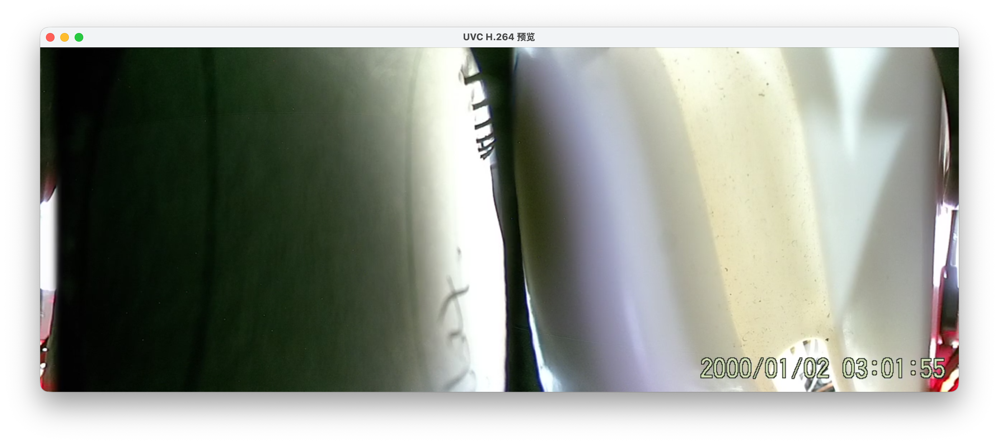

# UVC H.264 采集与预览工具

一个基于 `libuvc` 的工具，用于从 UVC 摄像头采集 H.264 视频流，支持实时预览和手动控制保存功能。

## 截图



## 功能特点
- **实时预览**：通过 `ffplay` 低延迟显示 H.264 视频流
- **灵活保存**：按 `s` 键可随时开始/停止将视频保存为 `output.h264`
- **自动适配**：自动识别摄像头支持的分辨率和帧率
- **优雅控制**：按 `q` 键或 `Ctrl+C` 可安全退出程序，确保资源释放


## 依赖环境
- **硬件**：支持 UVC 标准且具备 H.264 编码功能的摄像头（如 VID=0603:8612 的设备）
- **软件**：
  - macOS 系统（已测试）
  - `libuvc`：用于 UVC 设备通信
  - `libusb-1.0`：USB 设备访问库
  - `ffmpeg`：提供 `ffplay` 用于实时预览


## 安装依赖
1. 安装 `libuvc` 和 `libusb`：
   ```bash
   # 使用 Homebrew 安装
   brew install libuvc libusb
   ```

2. 安装 `ffmpeg`（用于预览）：
   ```bash
   brew install ffmpeg
   ```


## 编译与使用

### 编译程序
```bash
# 克隆或下载代码后进入目录
make  # 编译生成可执行文件
```

### 启动实时预览
```bash
sudo make run  # 需要 root 权限访问 USB 设备
```

### 操作说明
- **预览窗口**：程序启动后会自动弹出 `ffplay` 预览窗口
- **保存控制**：在终端按 `s` 键开始/停止保存视频（保存为 `output.h264`）
- **退出程序**：按 `q` 键或 `Ctrl+C` 退出


### 播放保存的文件
```bash
make play  # 使用 ffplay 播放 output.h264
```


## 目录结构
```
.
├── uvc_h264_preview.c  # 主程序代码
├── Makefile            # 编译配置
└── README.md           # 本说明文档
```


## 常见问题
1. **设备找不到**：
   - 确保摄像头已正确连接并支持 UVC 标准
   - 检查 USB 接口是否正常，尝试重新插拔设备

2. **预览窗口不显示**：
   - 确认已安装 `ffmpeg`（`ffplay` 命令可正常运行）
   - 检查摄像头是否真的支持 H.264 编码（程序会自动检测）

3. **权限错误**：
   - 必须使用 `sudo` 运行程序，否则无权限访问 USB 设备

4. **卡顿或延迟**：
   - 尝试降低分辨率（修改代码中 `width` 和 `height` 的默认值）
   - 关闭其他占用 CPU/USB 带宽的程序


## 代码说明
- 核心逻辑：通过 `libuvc` 采集 H.264 流，通过管道传递给 `ffplay` 实现实时预览
- 回调函数：`cb` 函数处理每帧数据，同时用于预览和保存
- 键盘控制：独立线程监听 `s`（保存）和 `q`（退出）按键事件
- 资源管理：程序退出时会自动释放设备资源、关闭文件和管道，确保数据完整


通过此工具，可快速验证 UVC 摄像头的 H.264 采集功能，适合开发调试或简单录像场景。
